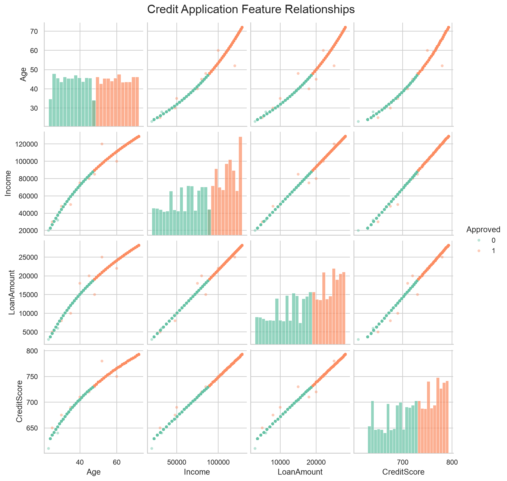
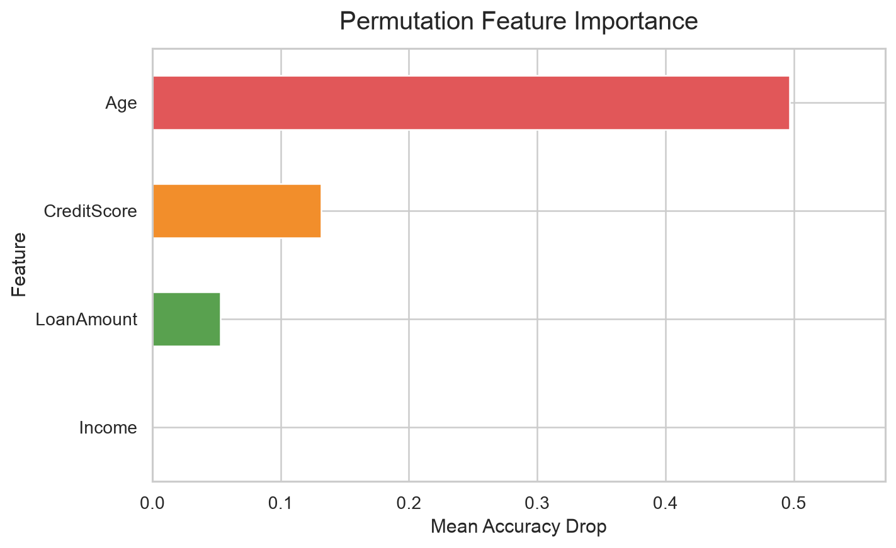

# Credit Application Analysis

This project analyzes a mock credit application dataset and trains a simple machine learning model to predict whether an application is approved.

The project is intentionally small and notebook-based. It is meant to demonstrate a basic supervised classification workflow using applicant attributes such as age, income, loan amount, and credit score.

## What This Project Does

The notebook:

1. Loads mock credit application data from `mock_credit.xlsx`.
2. Reviews summary statistics and missing values.
3. Visualizes relationships between the dataset columns.
4. Splits the data into training and test sets.
5. Trains a `DecisionTreeClassifier` from `scikit-learn`.
6. Evaluates the model with a confusion matrix and classification report.
7. Plots permutation feature importance to show which inputs most affect model accuracy.

## Machine Learning Used

Yes, this project uses machine learning.

It uses supervised classification because the dataset includes both input features and a known target label:

- Features: `Age`, `Income`, `LoanAmount`, `CreditScore`
- Target: `Approved`

The model learns patterns from historical mock applications and predicts whether new applications would be approved.

## Repository Files

| File | Purpose |
| --- | --- |
| `CreditAnalysis.ipynb` | Main Jupyter notebook containing the analysis and machine learning workflow. |
| `mock_credit.xlsx` | Mock credit application dataset used by the notebook. |
| `requirements.txt` | Python packages needed to run the notebook. |
| `images/` | Saved plot images used in this README. |

## Example Output

### Feature Relationships



### Permutation Feature Importance



The importance chart uses permutation importance on the test set. In this mock dataset, age is still the strongest signal because the data is highly separable around an age threshold. This is a property of the demo data, not a recommendation for real credit decisioning.

## Getting Started

Create and activate a virtual environment:

```bash
python3 -m venv .venv
source .venv/bin/activate
```

Install the dependencies:

```bash
pip install -r requirements.txt
```

Open the notebook:

```bash
jupyter notebook CreditAnalysis.ipynb
```

Then run the notebook cells from top to bottom.

## Data Note

`mock_credit.xlsx` is mock data for learning and demonstration. It should not be used to make real lending or credit decisions.

## Project Scope

This is a beginner-friendly credit approval classification project. It is not an earnings call analysis, sentiment analysis, or production credit risk system.
